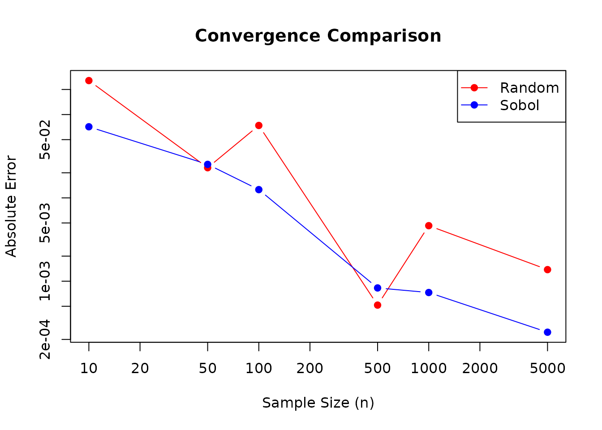

# Introduction to Sobol Sequences

## Introduction

The **sobol** package provides a fast and efficient implementation of
Sobol sequences for quasi-Monte Carlo (QMC) methods. Sobol sequences are
low-discrepancy sequences that provide better coverage of the unit
hypercube compared to pseudo-random numbers, making them valuable for
numerical integration, sensitivity analysis, and simulation studies.

### Historical Background

Sobol sequences were introduced by Ilya M. Sobol in 1967 as a method for
generating quasi-random points with low discrepancy. The implementation
in this package is based on:

- **Bratley, P., & Fox, B. L. (1988)**. “Algorithm 659: Implementing
  Sobol’s quasirandom sequence generator.” *ACM Transactions on
  Mathematical Software*, 14(1), 88-100. DOI:
  [10.1145/42288.214372](https://doi.org/10.1145/42288.214372)

- **Joe, S., & Kuo, F. Y. (2008)**. “Constructing Sobol sequences with
  better two-dimensional projections.” *SIAM Journal on Scientific
  Computing*, 30(5), 2635-2654. DOI:
  [10.1145/1358628.1358630](https://doi.org/10.1145/1358628.1358630)

The direction numbers used in this implementation come from Joe and
Kuo’s work, which ensures good two-dimensional projections and Property
A enforcement.

## Basic Usage

The package provides a simple interface for generating Sobol sequences.
Let’s start with a basic example:

``` r
library(sobol)

# Create a 3-dimensional Sobol generator
gen <- sobol_generator(dimensions = 3)

# Generate a single point
point <- sobol_next(gen)
print(point)
#> [1] 0 0 0

# Generate multiple points
points <- sobol_next_n(gen, n = 5)
print(points)
#>       [,1]  [,2]  [,3]
#> [1,] 0.500 0.500 0.500
#> [2,] 0.750 0.250 0.250
#> [3,] 0.250 0.750 0.750
#> [4,] 0.375 0.625 0.125
#> [5,] 0.875 0.125 0.625
```

## Key Features

### 1. Incremental Generation

The package supports incremental point generation, which is useful for
adaptive algorithms:

``` r
# Create a generator
gen <- sobol_generator(dimensions = 2)

# Generate points one at a time
for (i in 1:5) {
  point <- sobol_next(gen)
  cat("Point", i, ":", point, "\n")
}
#> Point 1 : 0 0 
#> Point 2 : 0.5 0.5 
#> Point 3 : 0.75 0.25 
#> Point 4 : 0.25 0.75 
#> Point 5 : 0.375 0.625

# Check current index
current_idx <- sobol_index(gen)
cat("Current index:", current_idx, "\n")
#> Current index: 5
```

### 2. Skip-Ahead Capability

For reproducibility and parallel processing, you can skip to any point
in the sequence:

``` r
# Create a generator starting from index 100
gen1 <- sobol_generator(dimensions = 2, skip = 100)
point1 <- sobol_next(gen1)

# Or skip to a specific index
gen2 <- sobol_generator(dimensions = 2)
sobol_skip_to(gen2, 100)
point2 <- sobol_next(gen2)

# These should be identical
print(all.equal(point1, point2))
#> [1] TRUE
```

### 3. Batch Generation

For large-scale simulations, generate many points at once:

``` r
# Generate 1000 points at once
gen <- sobol_generator(dimensions = 2)
points <- sobol_next_n(gen, n = 1000)

# Visualize the coverage
plot(points[, 1], points[, 2],
  pch = 20, cex = 0.5,
  main = "Sobol Sequence Coverage (2D)",
  xlab = "Dimension 1", ylab = "Dimension 2"
)
```


## Comparison with Random Sampling

One of the key advantages of Sobol sequences is their superior coverage
of the sampling space:

``` r
# Generate Sobol points
gen <- sobol_generator(dimensions = 2)
sobol_points <- sobol_next_n(gen, n = 1000)

# Generate random points
random_points <- matrix(runif(2000), ncol = 2)

# Plot comparison
par(mfrow = c(1, 2))
plot(sobol_points[, 1], sobol_points[, 2],
  pch = 20, cex = 0.5,
  main = "Sobol Sequence (n=1000)",
  xlab = "Dimension 1", ylab = "Dimension 2"
)

plot(random_points[, 1], random_points[, 2],
  pch = 20, cex = 0.5,
  main = "Random Sampling (n=1000)",
  xlab = "Dimension 1", ylab = "Dimension 2"
)
```


``` r
par(mfrow = c(1, 1))
```

Notice how the Sobol sequence provides more uniform coverage without
clustering.

## Monte Carlo Integration Example

Sobol sequences can significantly improve the accuracy of Monte Carlo
integration:

``` r
# Function to integrate: f(x, y) = x^2 + y^2 over [0,1]^2
# True value: 2/3
true_value <- 2 / 3

# Monte Carlo integration using random sampling
mc_random <- function(n) {
  points <- matrix(runif(2 * n), ncol = 2)
  mean(points[, 1]^2 + points[, 2]^2)
}

# Quasi-Monte Carlo integration using Sobol sequences
qmc_sobol <- function(n) {
  gen <- sobol_generator(dimensions = 2)
  points <- sobol_next_n(gen, n = n)
  mean(points[, 1]^2 + points[, 2]^2)
}

# Compare convergence
sample_sizes <- c(10, 50, 100, 500, 1000, 5000)
random_errors <- sapply(sample_sizes, function(n) abs(mc_random(n) - true_value))
sobol_errors <- sapply(sample_sizes, function(n) abs(qmc_sobol(n) - true_value))

# Plot convergence
plot(sample_sizes, random_errors,
  type = "b", log = "xy",
  col = "red", pch = 19,
  main = "Convergence Comparison",
  xlab = "Sample Size (n)", ylab = "Absolute Error",
  ylim = range(c(random_errors, sobol_errors))
)
lines(sample_sizes, sobol_errors, type = "b", col = "blue", pch = 19)
legend("topright", c("Random", "Sobol"),
  col = c("red", "blue"),
  pch = 19, lty = 1
)
```



## High-Dimensional Applications

Sobol sequences maintain their good properties even in high dimensions:

``` r
# Generate points in 10 dimensions
gen_10d <- sobol_generator(dimensions = 10)
points_10d <- sobol_next_n(gen_10d, n = 1000)

# Check dimensions
cat("Generated", nrow(points_10d), "points in", ncol(points_10d), "dimensions\n")
#> Generated 1000 points in 10 dimensions

# Examine coverage in first two dimensions
plot(points_10d[, 1], points_10d[, 2],
  pch = 20, cex = 0.5,
  main = "10D Sobol Sequence (Projection to 2D)",
  xlab = "Dimension 1", ylab = "Dimension 2"
)
```


## Performance Considerations

The package uses precomputed direction numbers for up to 1000
dimensions, providing significant performance improvements:

``` r
library(microbenchmark)

# Benchmark batch generation
microbenchmark(
  n_100 = {
    gen <- sobol_generator(dimensions = 10)
    sobol_next_n(gen, 100)
  },
  n_1000 = {
    gen <- sobol_generator(dimensions = 10)
    sobol_next_n(gen, 1000)
  },
  n_10000 = {
    gen <- sobol_generator(dimensions = 10)
    sobol_next_n(gen, 10000)
  },
  times = 100
)
```

## Advanced Usage: Parallel Processing

You can use skip-ahead to generate different portions of the sequence in
parallel:

``` r
library(parallel)

# Function to generate points from a specific range
generate_chunk <- function(start_idx, n, dims) {
  gen <- sobol_generator(dimensions = dims, skip = start_idx)
  sobol_next_n(gen, n = n)
}

# Generate 10,000 points in parallel chunks
cl <- makeCluster(4)
clusterEvalQ(cl, library(sobol))

chunks <- parLapply(cl, 0:3, function(i) {
  generate_chunk(start_idx = i * 2500, n = 2500, dims = 5)
})

stopCluster(cl)

# Combine results
all_points <- do.call(rbind, chunks)
cat("Generated", nrow(all_points), "points in parallel\n")
```

## Best Practices

1.  **Dimension Count**: Use the minimum number of dimensions needed for
    your problem
2.  **Sample Size**: Sobol sequences are most effective with sample
    sizes that are powers of 2 (e.g., 1024, 2048)
3.  **Skip Initial Points**: In some applications, skipping the first
    point (which is all zeros) may be beneficial
4.  **Reproducibility**: Use the `skip` parameter to ensure reproducible
    results

## References

- Sobol, I. M. (1967). “On the distribution of points in a cube and the
  approximate evaluation of integrals.” *USSR Computational Mathematics
  and Mathematical Physics*, 7(4), 86-112.

- Bratley, P., & Fox, B. L. (1988). “Algorithm 659: Implementing Sobol’s
  quasirandom sequence generator.” *ACM Transactions on Mathematical
  Software*, 14(1), 88-100.

- Joe, S., & Kuo, F. Y. (2008). “Constructing Sobol sequences with
  better two-dimensional projections.” *SIAM Journal on Scientific
  Computing*, 30(5), 2635-2654.

## Conclusion

The **sobol** package provides a robust, efficient implementation of
Sobol sequences suitable for a wide range of quasi-Monte Carlo
applications. Its incremental generation and skip-ahead capabilities
make it particularly useful for adaptive algorithms and parallel
processing.

For more information, see the package documentation and visit the
[GitHub repository](https://github.com/alrobles/sobol).
